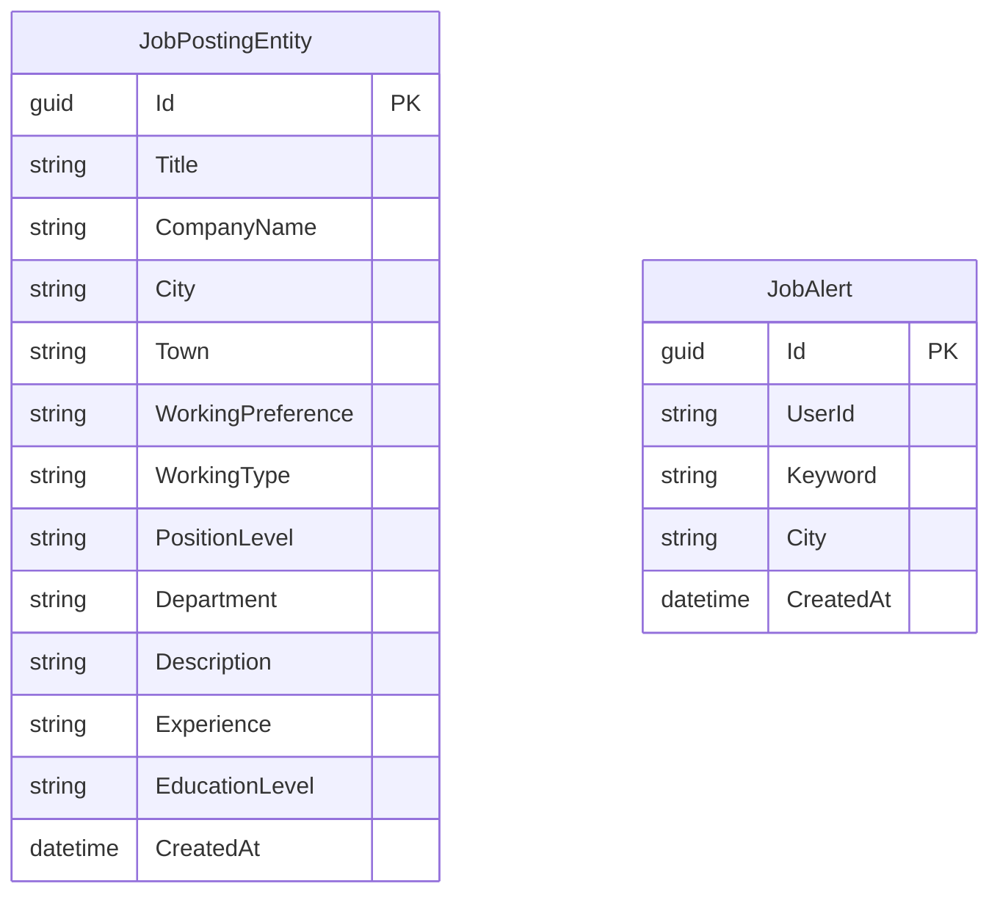

# KariyetNet - Job Search Web Application

🎥 **Project Presentation Video:** [Watch on Google Drive](https://drive.google.com/file/d/1Gmy4d8c_XWMakckdmIQOHfUtCjpPwz_S/view?usp=sharing)


## 1. Project Overview
KariyetNet is a group project for SE 4458 that implements a job search web application similar to kariyer.net. It is designed with a **Serverless & Managed Cloud** approach, eliminating the need for local database installations or Docker containers during runtime.

## 2. Cloud Services & Architecture
The system leverages various free-tier cloud providers to achieve high availability and scalability:
* **Relational Database (EF Core):** Supabase (PostgreSQL) - Used by `JobPosting.API` & `Notification.Worker`
* **NoSQL Database:** MongoDB Atlas - Used by `JobSearch.API`
* **Distributed Cache:** Upstash (Redis) - Used for caching job details.
* **Message Queue:** CloudAMQP (RabbitMQ) - Used for async event bus (MassTransit).
* **AI Engine:** Hugging Face Inference API (Mistral/Qwen) - Used by `AIAgent.API`
* **Authentication:** Firebase Auth
* **API Gateway:** Ocelot API Gateway

## 3. Assumptions & Issues Encountered
**Assumptions:**
* **AI Agent:** Real-time messaging (WebSockets) is not required per the assignment document. The agent uses a RESTful approach via Hugging Face Inference API with a fallback mechanism (Local NLP) for high availability.
* **Database Strategy:** To minimize local resource consumption, all databases and message queues are hosted on managed cloud services.

**Issues Encountered & Resolutions:**
* **Cloud Cold Starts:** Since the microservices are deployed on free-tier cloud instances (Render.com), initial cold starts caused timeouts between the API Gateway and downstream services. This was mitigated by implementing resilient timeout configurations and keeping the Gateway lightweight.
* **Secret Management Leakage Risks:** Managing multiple cloud credentials (Supabase, MongoDB, Upstash, HuggingFace) created initial risks for secret leakage during GitHub pushes. This was resolved by strictly enforcing `.gitignore` rules and injecting environment variables directly into the cloud providers' CI/CD pipelines.
* **RabbitMQ SSL Port and Health Check Blockages:** Connecting to CloudAMQP from free-tier Render services initially suffered from SSL handshake timeouts due to port/scheme mismatches (using port 5672 instead of 5671 for TLS). This, combined with MassTransit's default startup-blocking behavior, caused Render's deployment health checks to time out. We resolved this by hardcoding verified SSL URIs and configuring MassTransit to start asynchronously (`WaitUntilStarted = false`), allowing instant deployments and healthy background connection cycles.

## 4. Repository Layout & Requirements Covered
* `src/ClientApp` - React frontend
* `src/ApiGateway/OcelotApiGw` - API gateway
* `src/Services/JobPosting/JobPosting.API` - job posting service
* `src/Services/JobSearch/JobSearch.API` - search and history service
* `src/Services/Notification/Notification.Worker` - notification worker
* `src/Services/AIAgent/AIAgent.API` - AI assistant service
* `tests/JobPosting.API.Tests` - backend unit tests

**Key Features Implemented:**
* Search by position and city (with distributed caching)
* Admin job management
* Notification alerts and related-job background tasks
* AI agent chat experience

## 5. Microservices Startup & Execution Guide 🚀

This project utilizes a decentralized microservices architecture connecting directly to managed cloud infrastructures. Consequently, local runtime environment dependencies (such as Docker or locally hosted databases) are bypassed during local development.

To orchestrate the system locally, each microservice must be spun up in an isolated shell session. Navigate to the repository root directory on your machine, then follow the precise sequence below to ensure proper upstream gateway routing and integration.

---

### 💻 Orchestration Sequence & CLI Commands

Execute the following commands in separate terminal sessions or tabs (all paths are relative to the repository root):

#### 1. API Gateway (Ocelot)
Establishes the single ingress point that aggregates and routes downstream HTTP requests.
```bash
cd src/ApiGateway/OcelotApiGw
dotnet run
```
* **Binding URL:** `http://localhost:5000`

#### 2. Job Posting Service (JobPosting.API)
Manages transactional job postings, persisting metadata to Supabase (PostgreSQL) and publishing events via MassTransit (RabbitMQ).
```bash
cd src/Services/JobPosting/JobPosting.API
dotnet run
```
* **Binding URL:** `http://localhost:5001`

#### 3. Job Search Service (JobSearch.API)
Serves fast search queries using an in-memory Redis cache and retains search logs in MongoDB Atlas.
```bash
cd src/Services/JobSearch/JobSearch.API
dotnet run
```
* **Binding URL:** `http://localhost:5002`

#### 4. AI Copilot Agent (AIAgent.API)
Leverages Hugging Face Inference endpoints for NLP parameter extraction and provides contextual responses to chat clients.
```bash
cd src/Services/AIAgent/AIAgent.API
dotnet run
```
* **Binding URL:** `http://localhost:5004`

#### 5. Notification Worker (Notification.Worker)
An asynchronous background task consumer utilizing MassTransit to subscribe to integration events and Quartz.NET for scheduled jobs.
```bash
cd src/Services/Notification/Notification.Worker
dotnet run
```
* **Binding URL:** `http://localhost:5003`

#### 6. Single Page Application (ClientApp)
The React + Vite frontend SPA. Ensure node modules are installed before initiating the Vite development server.
```bash
cd src/ClientApp
npm install
npm run dev
```
* **Ingress URL:** `http://localhost:5173`

---

### 🧪 Running Test Suites (Optional)
To execute the unit and integration tests across the backend projects:
```bash
dotnet test tests/JobPosting.API.Tests/JobPosting.API.Tests.csproj
```

## 6. Deployed URLs
* **Frontend (React UI):** https://se-4458-final-kariyet-net.vercel.app/
* **API Gateway (Ingress Router):** https://kariyernet-apigateway.onrender.com
* **Job Posting Service (PostgreSQL write API):** https://kariyernet-jobposting-api.onrender.com
* **Job Search Service (MongoDB/Redis read API):** https://kariyernet-jobsearch-api.onrender.com
* **AI Agent Service (NLP chat helper API):** https://kariyernet-aiagent-api.onrender.com
* **Notification Service (Alerts/Background worker):** https://kariyernet-notification-worker.onrender.com

---

## 7. Data Models & Database Architecture (ER Diagram) 📊

To fulfill the requirements of high-scalability and low local resource footprint, the system implements a polyglot persistence layer combining relational PostgreSQL, document-oriented NoSQL, and a distributed cache.

### 🗄️ 1. Relational Layer: PostgreSQL (Supabase)
This layer handles strict transactional, structured data. Entity Framework Core (Code-First) manages these migrations.



### 📂 2. NoSQL Layer: MongoDB Atlas (Document Store)
Used to store semi-structured, high-throughput analytical documents such as search histories and application logs.

* **Collection: `JobApplications`**
  Stores records of job applications to guarantee that users cannot apply to the same job multiple times.
  ```json
  {
    "_id": "ObjectId",
    "UserId": "string",
    "JobId": "string (Guid)",
    "AppliedAt": "ISODate"
  }
  ```
  
* **Collection: `UserSearchHistories`**
  Maintains audit logs of search inputs for personal "Son Aramalarım" autocomplete widgets and background alert processors.
  ```json
  {
    "_id": "ObjectId",
    "UserId": "string",
    "PositionKeyword": "string",
    "City": "string",
    "SearchedAt": "ISODate"
  }
  ```

### ⚡ 3. Distributed Cache: Upstash Redis
To prevent redundant database roundtrips, search results and active job details are cached with customizable time-to-live (TTL) strategies.
* **Cache Key Schema (Active Job Postings):** `jobposting:{id}`
* **Cache Key Schema (Query Results):** `jobsearch:{position}:{city}:{town}:{workingPreference}:{page}`
